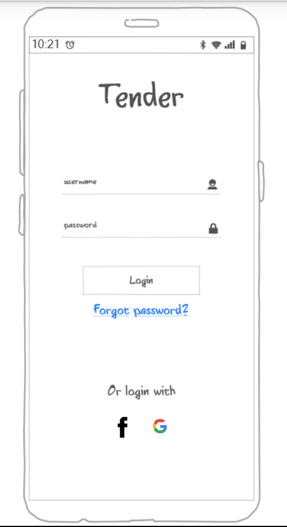
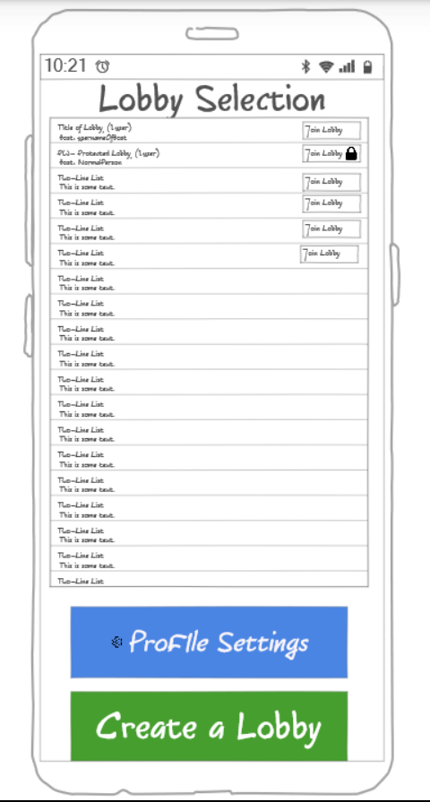
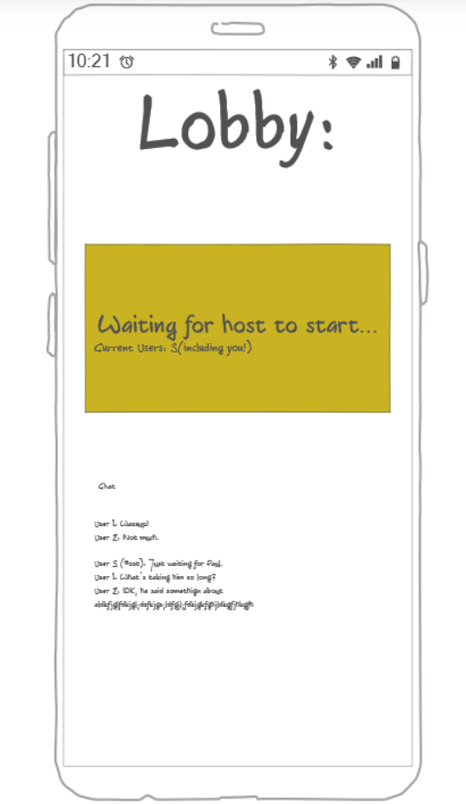

# startup
 cs project
## CSS
this is structured as your announcement said to:
[x] - done - Prerequisite: Simon CSS deployed to your production environment
[x] - done - Prerequisite: A link to your GitHub startup repository prominently displayed on your application's home page
[x] - done - Prerequisite: Notes in your startup Git repository README.md file
[x] - done - 30% Header, footer, and main content body. Used flex to layout sections.
[x] - done - 20% Navigation elements. FIXME navelements highlighting is actually a great idea. Might use that.
[x] - done - 10% Responsive to window resizing. Looks nice on desktop, better on mobile.
[x] - done - 20% Application elements. Buttons use a onhover css element to make them responsive with a darker color.
[x] - done - 10% Application text content. Text is displayed using the Georgia font, with exceptions in the footer in order for it to look *impressive*
[x] - done - 10% Application images. FIXME I should probably get this done. Should the chicken tender image stay? I don't know. Probably just for the About page.

## HTML
sorry, didn't include this last time. They found everything they needed to other than the placeholder for an outside service call. That'll be in the lobby.html. I added some text to make it more obvious in the future, so we should be fine. :)

### [Notes](notes.md)
# Specifications:
## Elevator Pitch: 
&nbsp;&nbsp;&nbsp;&nbsp;&nbsp; The short version of the idea is that this is like Tinder but for nearby restaurants. I'm going to call it Tender. Users will be able to get together, physically or not, and be able to vote on what food they want to eat that is nearby. Users will be able to blacklist certain places so that they will not appear in the possible restaurants to buy food from. Finding the correct lobby can be done via a lobby selector, which will one day be upgraded to have friends and a search function. But for now, it is meant to be a small community that needs a little help deciding where to eat.
## Key Features and Description:
### Logging in and Creating an Account
The user should be able to access their account by entering a username and password or using some other authentication method. Usernames should be unique, and passwords should be reasonably strong (min. characters)
### Retrieving and Editing Profile Data from the Database
The user should be able to edit certain settings, like managing their blacklist. Things can be manually added, but a prompt will appear after a store is "denied" in the "game" portion of the application 5 times in a row by the same user, asking if they would like that store to be added to their blacklist. 
### Joining a Lobby and Chatting there
After logging in, users should be able to see any open lobbies. Once the "game" portion of the lobby starts, it should no longer appear in the lobby selector. Users should be able to chat while they are waiting for the rest of their party to join the lobby. Once everyone is inside the lobby, the host should be able to start the next section. A link could also be used to join directly, without using the lobby system.
### Playing the "Choose Where to Eat" Game
In an interface similar to Tinder, users should be able to collectively vote on food sources that they are most interested in consuming from. There would be multiple rounds, depending on how many restaurants are nearby and the lobby's settings (cost, avg. reviews, max rounds). In each round, the top-ranking restaurants will be promoted to the next. If the final round ends with a tie, then the winner is chosen at random. There will be a "rock the vote" option, which if chosen by the majority of users, will switch the winner to whatever was in second place instead.
## Design Images (with descriptions)

The login page will be generic. Nothing special here. Checks login information against authentication information stored in a database. Creates a session token for the application to use.

Lobbies on the internet are listed here. You can also edit your profile settings through the blue button at the bottom. Creating a lobby is done using the green button on the bottom.

This is the lobby screen. With a chatbox on the bottom for non-hosts, users will be able to message each other until the minigame starts.
